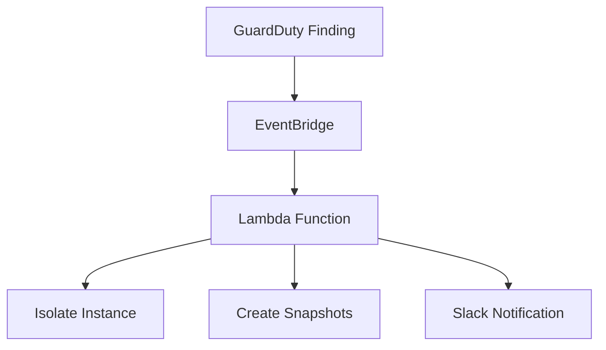

# How to Build an Automated AWS Incident Response System with GuardDuty, EventBridge, Lambda, and Slack
# AWS GuardDuty Auto-Remediation Bot

An automated incident response solution that detects AWS GuardDuty findings and executes remediation actions including instance isolation, forensic snapshots, and Slack notifications.

---


## 📖 Detailed Walkthrough
For a comprehensive step-by-step guide, including screenshots and detailed explanations, check out the full tutorial on Medium:
[**How to Build an Automated AWS Incident Response System with GuardDuty, EventBridge, Lambda, and Slack**](https://towardsaws.com/how-to-build-an-automated-aws-incident-response-system-with-guardduty-eventbridge-lambda-and-7e5ae18c85cd?source=friends_link&sk=2a3a486e4f49a2801e32f7309391bdea)

---
## Features

- 🚨 **Real-time detection** of EC2 compromises via GuardDuty
- 🔒 **Automatic isolation** of compromised instances
- 📸 **Forensic evidence collection** via EBS snapshots
- 📢 **Instant alerts** to Slack channels
- ⚡ **Serverless architecture** (100% AWS Lambda)

## Architecture


# AWS Incident Response Lambda Tool

## Prerequisites

- AWS account with admin permissions  
- Slack workspace with incoming webhook configured  
- Python 3.9 (for local testing)

## Deployment

### 1. IAM Setup

Create IAM policy and role for Lambda execution:
```json
{
  "Version": "2012-10-17",
  "Statement": [
    {
      "Action": [
        "ec2:DescribeInstances",
        "ec2:ModifyInstanceAttribute",
        "ec2:CreateSnapshot",
        "ec2:DescribeVolumes"
      ],
      "Effect": "Allow",
      "Resource": "*"
    },
    {
      "Action": [
        "logs:CreateLogGroup",
        "logs:CreateLogStream",
        "logs:PutLogEvents"
      ],
      "Effect": "Allow",
      "Resource": "*"
    }
  ]
}
```
### 2.  Quarantine Security Group
Create a security group with:

- No inbound rules

- No outbound rules

- Name: Quarantine-SG

### 3. Lambda Deployment
Deploy the function with:

- Runtime: Python 3.9

- Handler: lambda_function.lambda_handler

- Environment variables:

  - SLACK_WEBHOOK_URL

  - ISOLATION_SG_ID
### 4. EventBridge Rule
Create rule with pattern:
```json
  {
  "source": ["aws.guardduty"],
  "detail-type": ["GuardDuty Finding"],
  "detail": {
    "severity": [{"numeric": [">=", 7]}],
    "resource": {
      "resourceType": ["Instance"]
    }
  }
}
```
### 5. Testing
Create an EC2 Instance and Simulate an attack:
run guardduty_simulation.sh file on the EC2 Instance

```bash
chmod +x guardduty_simulation.sh
./guardduty_simulation.sh
```
### 6. Verify:

- Instance security group changes to Quarantine-SG

- EBS snapshots are created

- Slack notification received

## Detailed Tutorial
For a comprehensive step-by-step guide, including screenshots and detailed explanations, check out the full tutorial on Medium:
[**How to Build an Automated AWS Incident Response System with GuardDuty, EventBridge, Lambda, and Slack**](https://towardsaws.com/how-to-build-an-automated-aws-incident-response-system-with-guardduty-eventbridge-lambda-and-7e5ae18c85cd?source=friends_link&sk=2a3a486e4f49a2801e32f7309391bdea)

## 📬 Connect With Me
- 💼 [LinkedIn](https://www.linkedin.com/in/abdulhakeem-sulaiman/)
- ☕ [Support me on BuyMeACoffee](https://buymeacoffee.com/aatikah)
- 🧪 [Explore More Projects on GitHub](https://github.com/aatikah)

---

